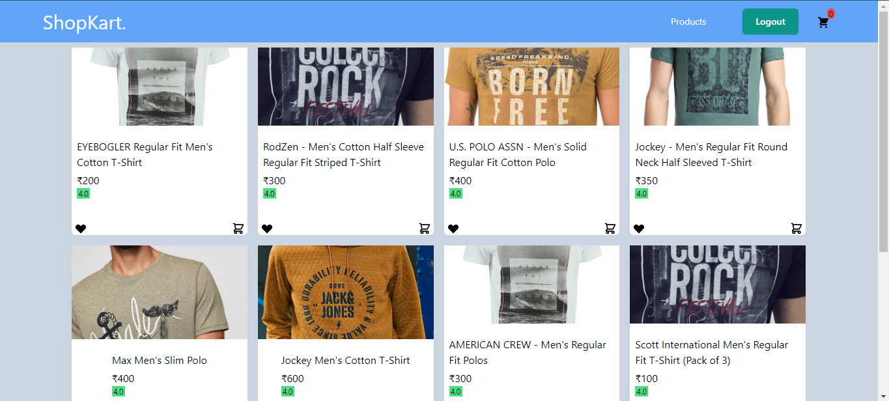
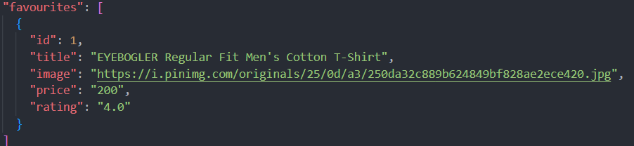
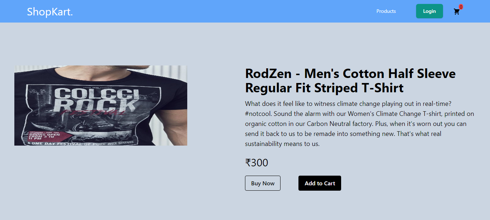
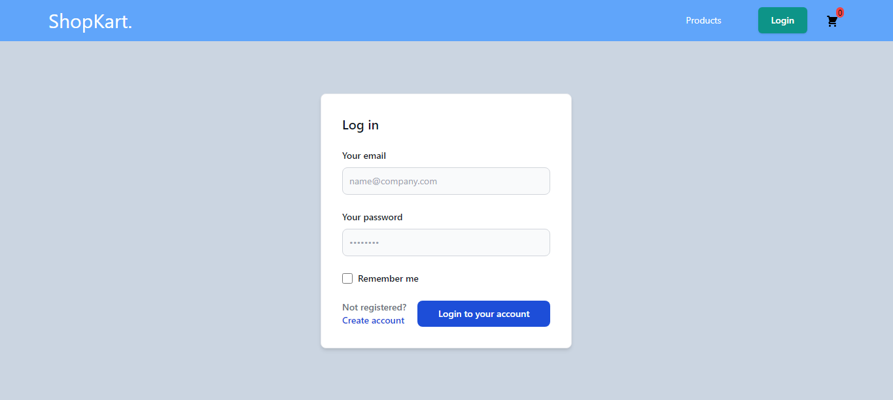
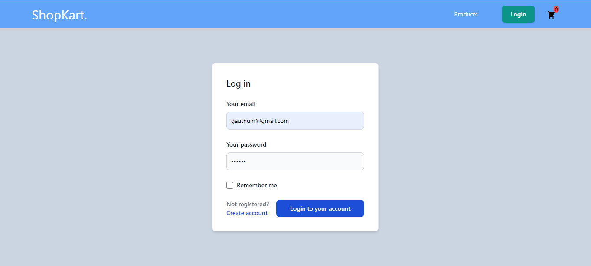
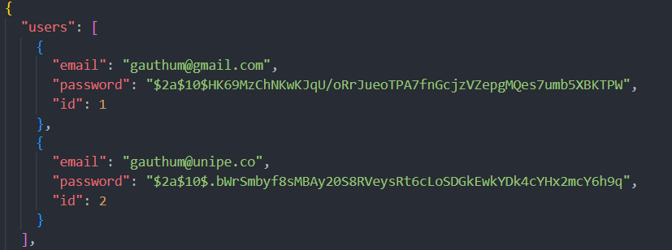
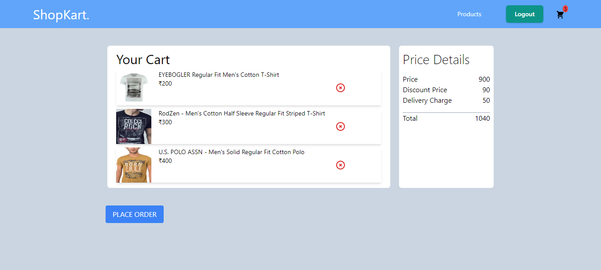
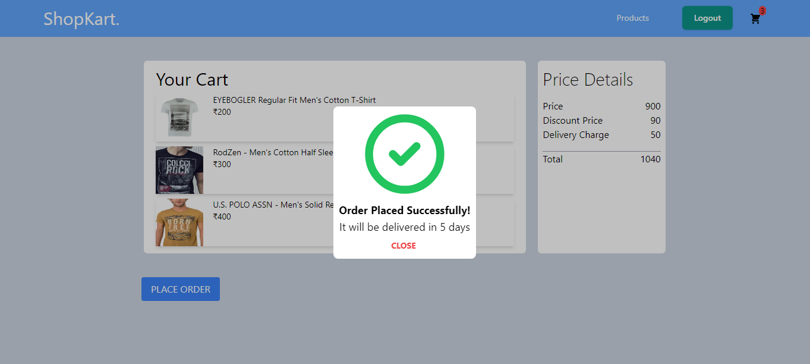
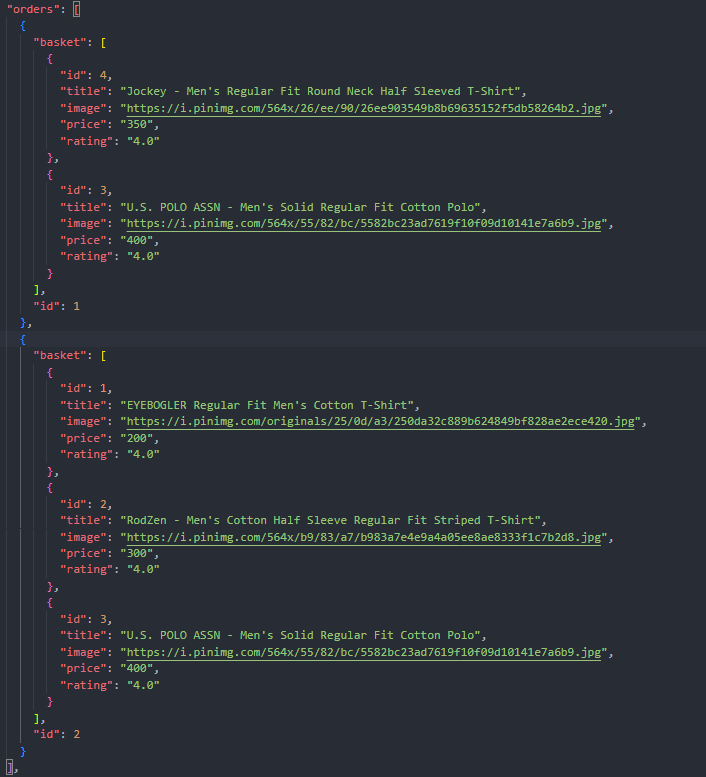

# Ecommerce Website

A simple Ecommerce website built with react and tailwind CSS. JSON server used for the backend to store user data for authentication, orders, favorites.

Context API used for state management, React Router used for navigation.

## Home Page

### Favorites:

## Product Page

## Login/Signup Page

> User can signup by clicking create account and using the same input fields as the signup form.

## Checkout Page

## Possible Future Additions:

- Third Party Payment Integration
- Third Party Auth like Google, Facebook, etc.
- Recaptcha for security
- Reccommendations/ Frequently Bought Together
- Forgot Password
- For-You-Page based on favorites and previous orders